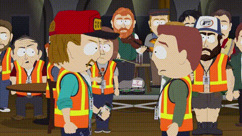
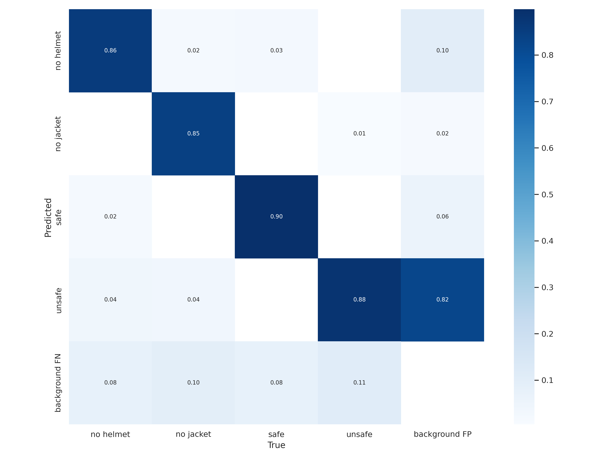
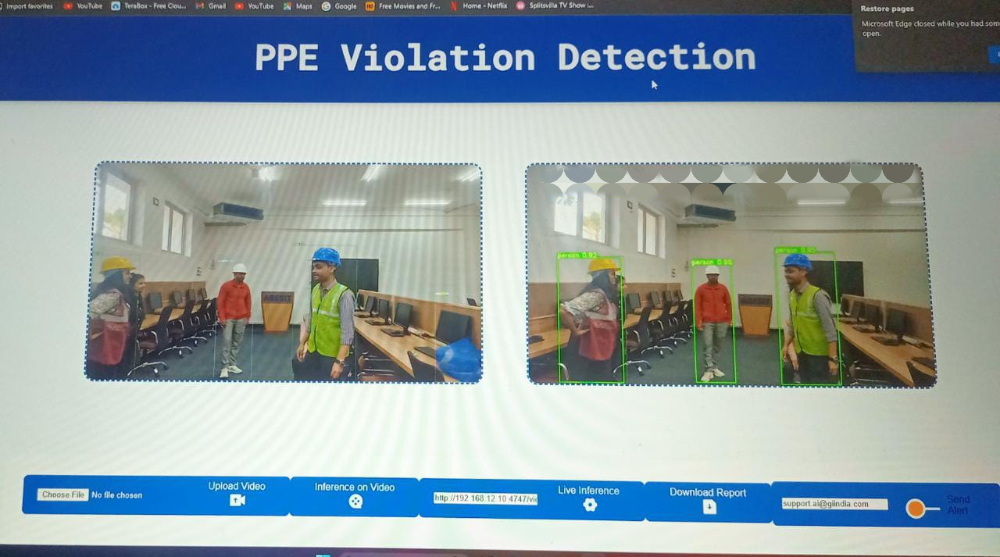
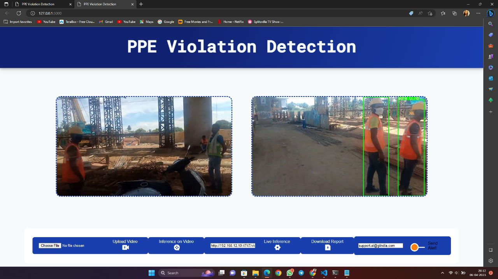

# PPE Detection for Construction Site Safety using YoloV7

>In 2020, a total of 4,764 workers lost their lives while on the job, which corresponds to a rate of 3.4 fatalities per 100,000 full-time equivalent workers. Roughly half of all fatal occupational injuries, amounting to 47.4 percent, were attributed to workers in transportation and material moving occupations (1,282 deaths) and construction and extraction occupations (976 deaths).>
> *Occupational Safety and Health Administration (US Department of Labour)*

## Introduction

Insufficient provision of personal protective equipment (PPE) and safety gear for construction workers is resulting in a rise in on-site fatalities and injuries among them. The objective of this initiative was to develop a system capable of identifying instances of PPE non-compliance among workers and automatically notifying the administrator via email. This project involved the utilization of a custom dataset, meticulously collected by our team, and employed Kubeflow for training purposes.(https://universe.roboflow.com/ppe-detection-csg9b/ppe-detection-siklb/dataset/2).

For easier use the dataset is already uploaded here: (https://universe.roboflow.com/ppe-detection-csg9b/ppe-detection-siklb).

The dataset includes a total of 1630 image samples labeled in YoloV7 format. These images are divided into three sets: `train` with 1137 samples, `valid` with 324 samples, and `test` with 169 samples. Each set contains two folders, namely `images` and `labels`.

There are 4 classes to detect from the dataset:

**'no helmet', 'no jacket', 'safe', 'unsafe'**

## Setup

To ensure successful execution, it is recommended to have the code trained on Kubeflow and run it on a DGX A100 GPU. It is important to include the client_secrets.json file in the main folder and update the sender email address in the hubconfCustom.py file with the corresponding email address that possesses the required credentials.

**Note:** This repository contains all the results, visualizations and best model after custom training on the dataset.

## Results

After training, we get the following results:

## Outputs

curl -L "https://universe.roboflow.com/ds/e1MTF33K2k?key=3PCd70v64d" &gt; roboflow.zip; unzip roboflow.zip; rm roboflow.zip
